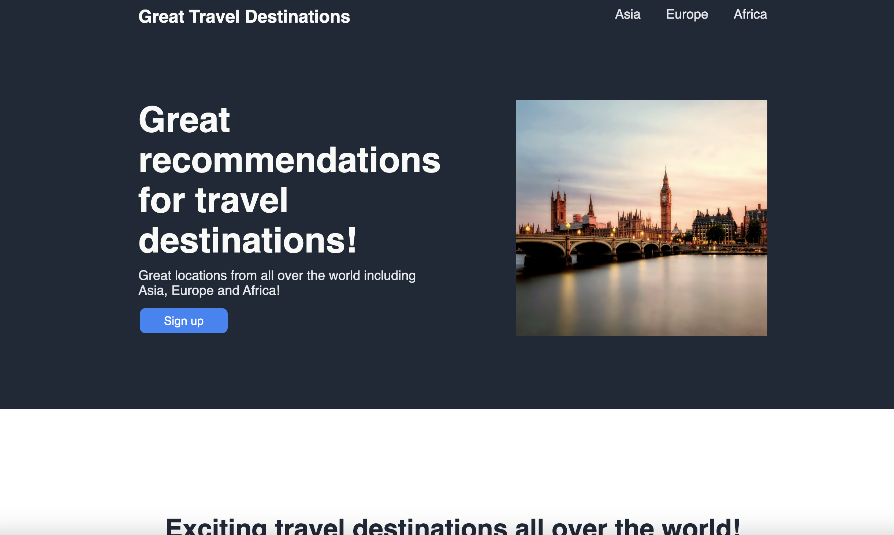
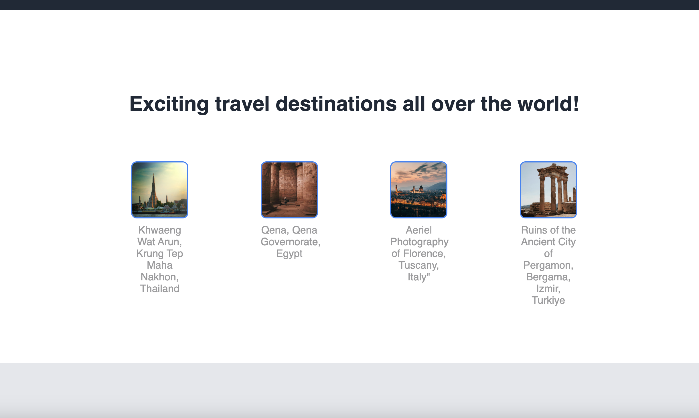

# Landing Page

This is a landing page showcasing great travel destinations from around the world.

## Motivation

The motivation behind this project is to inspire and inform people about exciting travel destinations across the globe. Traveling allows us to explore diverse cultures, experience new adventures, and broaden our horizons. This landing page aims to spark curiosity and provide users with a glimpse of the amazing places they can visit. Whether it's the bustling streets of Asia, the historic wonders of Europe, or the rich landscapes of Africa, this page aims to ignite the desire for exploration and discovery.

# Build Status

Webpage complete

# Code Style

The code for this landing page follows a clean and organized structure, adhering to the following code style guidelines:

- All HTML files follow the proper document structure and utilize appropriate HTML5 elements.
- CSS styling is separated into an external style.css file and linked to the HTML file.
- CSS class names are descriptive and follow the BEM (Block Element Modifier) naming convention.
- The code uses consistent indentation and spacing for improved readability.
- Semantic class names and comments are used to provide clarity and understanding.
- The code is optimized for responsiveness and supports different screen sizes.

# Screenshots




# Tech/Framework used

- HTML: The standard markup language for creating the structure and content of the page.
- CSS: Cascading Style Sheets are used for styling and layout purposes.
- Responsive Design: The page is designed to be responsive and adapt to different screen sizes for an optimal viewing experience.

# Features

- The landing page features visually appealing images of various travel destinations, enticing users to explore further.
- The top links provide quick access to popular travel destinations, allowing users to easily navigate to specific regions.
- The main text and secondary text provide enticing descriptions of the travel destinations, capturing the interest of visitors.
- The page is designed to be responsive, ensuring a seamless and optimal viewing experience across different devices and screen sizes.
- The "Sign up" button encourages users to take action and sign up for a lifetime of adventure, driving user engagement.
- A quote by Ibn Battuta adds credibility and a human touch to the page, emphasizing the positive impact of travel on personal growth.
- The footer section displays the copyright information, providing legal information and adding a professional touch to the page.

These features work together to create an immersive and captivating experience for users, inspiring them to explore and plan their next travel adventure.

# Code Examples
- HTML 

<div class="section1">
    <!-- ... -->
    <h1 class="mainText">Great recommendations for travel destinations!</h1>
    <p class="secondaryText">Great locations from all over the world including Asia, Europe and Africa!</p>
    <button>Sign up</button>
    <!-- ... -->
</div>

- CSS 

button {
  background-color: #3882F6; 
  border: none; 
  color: white; 
  padding: 8px 8px; 
  text-align: center; 
  text-decoration: none; 
  display: inline-block; 
  font-size: 16px;
  margin: 4px 2px; 
  cursor: pointer; 
  width: 120px;
  border-radius: 8px;
}

# Installation

To run the landing page locally, follow these steps:

1. Fork the repository by clicking on the "Fork" button at the top right corner of the repository page. This will create a copy of the repository in your GitHub account.

2. Clone the forked repository to your local machine using the following command:

   ```
   git clone <your-forked-repository-url> (Use SSH url found by clicking Code button and then clicking SSH)
   ```

3. Navigate to the project directory:

   ```
   cd <project-directory>
   ```

4. Open the `index.html` file in your preferred web browser.

That's it! You should now be able to view the landing page locally on your machine.

Alternatively, you can deploy the landing page to a web server of your choice and access it through a web browser.

# API reference

# Tests

# How to Use? 

To use the landing page, follow these steps:

1. After following the installation instructions, open the `index.html` file in your web browser. 

   OR 

   Click the following link: https://adilshads.github.io/landing-page/

2. Explore the landing page by scrolling through the sections. The page is divided into several sections, each showcasing different content related to travel destinations.

3. In the "Great Travel Destinations" section, you will find links to different continents. Click on the links to navigate to specific travel destinations within each continent.

4. In the "Exciting Travel Destinations" section, you will find images and captions of various travel destinations. Feel free to click on the images to view them in more detail or learn more about the destinations.

5. In the "Quote" section, you will find an inspiring quote about the value of travel. Take a moment to reflect on the message and its significance.

6. In the "Take the Leap" section, you will find a call-to-action message and a "Sign up" button. If you're interested in receiving more information or updates about travel destinations, click the "Sign up" button to proceed.

7. At the bottom of the landing page, you will find the footer section with copyright information.

8. Happy exploring and safe travels!

# Contribute

# Credits


Image credit: [Pixabay](https://www.pexels.com/@pixabay/)


Image Credit: [Kasper Rasmussen](https://www.pexels.com/@freestockpro/)


Image Credit: [Yasmine Qasem](https://www.pexels.com/@yasmine-qasem-1054896/)


Image Credit: [Josh Hild](https://www.pexels.com/@josh-hild-1270765/)


Image Credit: [Gizem Mat](https://www.pexels.com/@gizem-mat/) 

# License


